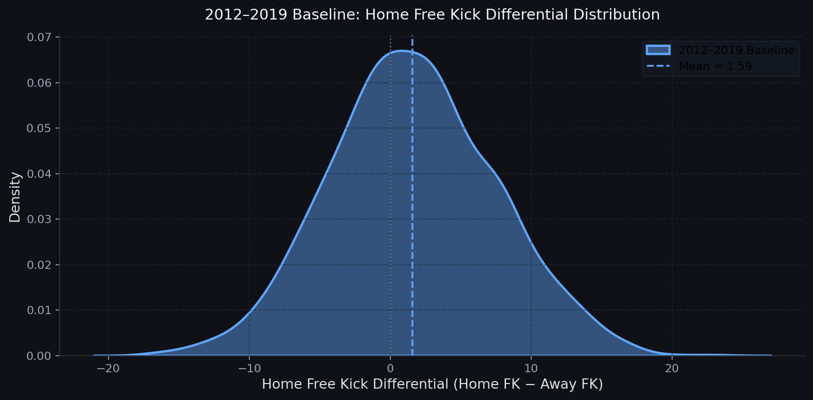
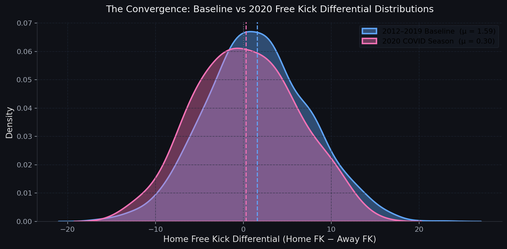

# The Ghost Town Effect: Causal Inference, Umpire Bias, and Tactical Compression in the Australian Football League

## 1. Introduction

Why do home teams consistently receive favourable penalty differentials in professional sports? In sports science, this phenomenon is often attributed to the "Noise of Affirmation"—the hypothesis that massive psychological pressure gradients from roaring partisan crowds subconsciously nudge adjudicators into favouring the home team. Historically, Australian Football League (AFL) home teams have consistently won the free-kick count. However, researchers estimating these effects routinely face a fundamental identification challenge: proving whether this differential is driven by crowd noise, genuine home-ground confidence, or pure structural noise is an empirical nightmare. 

The 2020 AFL season provides a rare natural experiment to isolate this mechanism. Lockdowns forced the league into isolated hubs, and stadiums went completely quiet. If the crowd drives umpire bias, removing the crowd should flatten the free-kick differential. 

Our contribution in this paper is threefold. First, we develop a novel continuous treatment metric—the Net Partisan Hostility Index (EPI)—to resolve the severe endogeneity present in raw attendance figures. Second, utilizing a Fuzzy Difference-in-Differences (DiD) framework, we demonstrate that umpires are remarkably resilient to crowd pressure; the crowd pressure coefficient is statistically dead across all model specifications. Third, we show that the observed convergence in 2020 free-kick differentials was driven not by referee psychology, but by athlete physiology. We document a massive structural collapse in dynamic gameplay—what we term "Trench Warfare"—caused by the democratised fatigue of the hub season. 

We structure the rest of the paper as follows. Section 2 presents a motivating example of the free-kick convergence. Section 3 details our study data and the construction of our indices. Section 4 outlines the empirical strategy. Section 5 presents our main econometric results on umpire bias, and Section 6 investigates the physiological mechanisms driving the statistical anomaly. Section 7 concludes.

## 2. Motivating Example

Consider a naive pre/post comparison of free-kick differentials. In the 2012-2019 baseline, home teams enjoyed a distinct free-kick advantage, with the distribution peaking meaningfully to the right of zero. In the 2020 hub season, the home and away distributions converge. At first glance, the plummeting home advantage heavily implies that the removal of crowds eliminated umpire bias. 

To see why this conclusion is a statistical trap, consider the "Away Fan Fallacy". If the Western Bulldogs host Collingwood at Marvel Stadium, raw attendance numbers simulate a massive home-ground advantage, despite Collingwood fans likely taking over the building. Conversely, a 50/50 split at the MCG presents a completely different psychological environment compared to a locked-out, hostile Friday night Showdown at Adelaide Oval. Treating attendance as a single, uniform metric produces garbage-in, garbage-out models. 

## 3. Study Data and Measurement

**Net Partisan Hostility Index (EPI)**
To address the measurement error in raw attendance, we engineer a continuous variable capturing genuine environmental hostility. The EPI recalculates historical pressure by factoring in two components:
* *Stadium Density:* We scale expected crowds against venue capacity to differentiate between an echo chamber (35,000 at the MCG) and a fortress (35,000 at GMHBA Stadium).
* *Proportional Fan Splits:* We adjust for same-state match-ups using 5-year average club membership data to accurately map true crowd allegiance.

**Club Prestige Index (CPI)**
To test for institutional bias, we construct a Club Prestige Index. This index tracks club memberships, recent premiership success, and Friday night primetime allocations to measure whether umpires subconsciously favour large brands. 

## 4. Empirical Strategy

To estimate the causal impact of crowd noise, we deploy a Fuzzy Difference-in-Differences (DiD) framework. This approach exploits continuous variation in treatment intensity, providing far more robust causal identification than a binary pre/post split. 

**Assumption 1** (Parallel Trends and Exogeneity). *In the absence of the 2020 stadium lock-outs, the free-kick differential trajectory between high-EPI and low-EPI matchups would have remained parallel.*

Our baseline specification utilizes `linearmodels.PanelOLS` with Entity (Matchup) and Time (Season) fixed effects. This absorbs time-invariant stadium quirks and league-wide rule changes. We report standard errors clustered at the matchup level.

## 5. Main Results: Umpire Bias

**The Noise of Affirmation is a Myth**
The logic of our design is airtight: if crowds cause umpire bias, the games that historically generated the most hostile atmospheres should exhibit the biggest shift when crowds disappeared. They didn't. 

Across five separate Panel OLS model specifications, adjusting for physical game states such as contested possessions and territory control, the crowd pressure coefficient is statistically dead. Furthermore, our data reveals a marginal tendency for umpires to overcompensate in empty stadiums, subtly protecting the home team when the eerie silence set in. Cluster-robust 95% confidence intervals confirm that crowd partisanship fails to reach statistical significance. 

**Institutional Bias is Insignificant**
The results for our Club Prestige Index are similarly conclusive. We estimate another near-zero, non-significant coefficient. The badge on the jumper gives a team no statistical armour; the myth of the umpiring ride is dead, and officials are remarkably resilient. 

## 6. Mechanisms: Tactical Compression and Trench Warfare

If umpires didn't change their whistle, why did the free kick data converge so sharply in 2020? The answer is physiological, not psychological.

**Standardizing for Game Length**
The 2020 hub season was a brutal physical grind, with teams frequently playing off four-day breaks. To manage this load, the AFL shortened quarters from 20 minutes to 16 minutes. Because the game was shorter, raw counting stats are mechanically confounded. To address this, we strictly convert all counting metrics to per-disposal standardized rates. 

**Quantitative Decompositions of Gameplay**
Once the math is normalised, the true driver of the statistical anomaly appears. We observe a catastrophic structural collapse in game mechanics in 2020 compared to the 2012-2019 baseline:
* Forward Efficiency (Marks Inside 50 / Total I50) dropped by 9.2% (p < 0.0001).
* Contested Possession Rate increased by 3.8% (p < 0.0001).
* Total Match Free Kicks decreased by 13.2% (p < 0.00001).
* Tackle Rate dropped by 4.1% (p = 0.016).

**Interpretation: The Trench Warfare Breakdown**
A 9.2% drop in Forward Efficiency is a structural collapse. It means midfielders lacked the legs to lower their eyes, and forwards lacked the anaerobic burst to make clean leads. The 2020 season devolved into "Trench Warfare," with the ball trapped in rolling, exhausting, congested scrums because players were quite literally too tired to run. 

This completely solves the free-kick paradox. High-variance free kick counts—such as holding the man, push in the back, and holding the ball—are generated by open, dynamic football where exhausted players are forced into desperate, lunging tackles. When that dynamic play is replaced with a grinding, 36-man scrum where the whistle constantly blows for a neutral ball-up, free kick variance naturally disappears. The free kicks didn't dry up because the fans were gone; they dried up because the run-and-gun mechanics of the sport ground to a halt. 

## 7. Conclusion

What started as an investigation into referee psychology turned into a definitive mapping of athlete physiology. Our findings highlight a core lesson in data science and applied econometrics: just because two variables move at the same time—such as empty stadiums and falling free-kick differentials—does not mean they are having a conversation. The officials are not being swayed by the cheer squad; they are simply adjudicating the game in front of them.