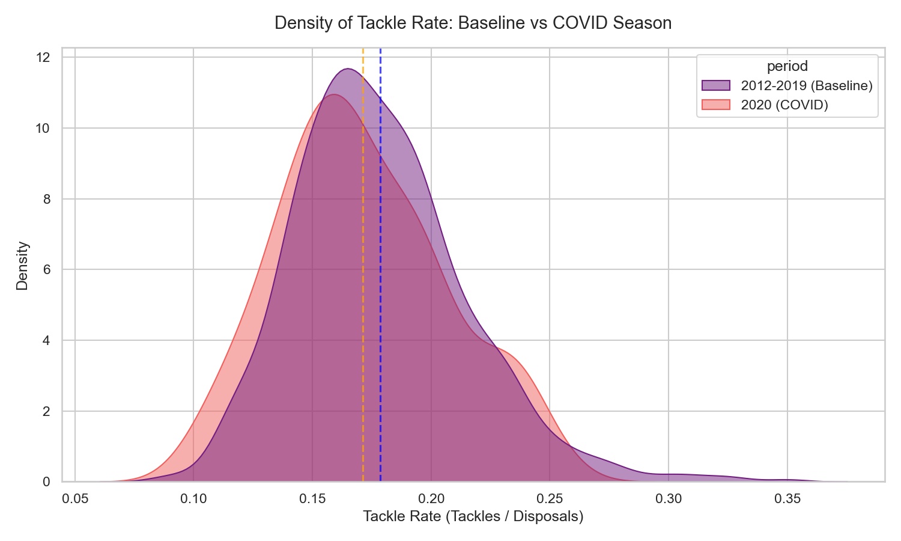
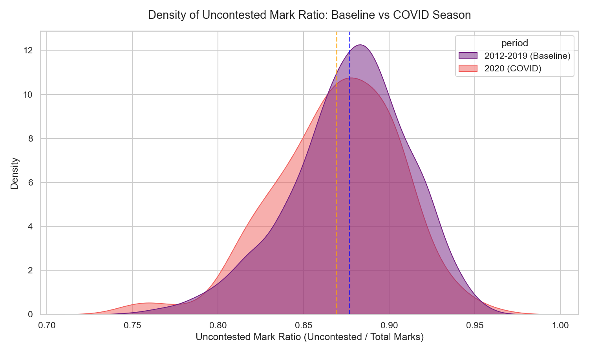
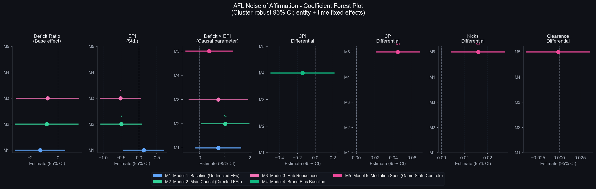
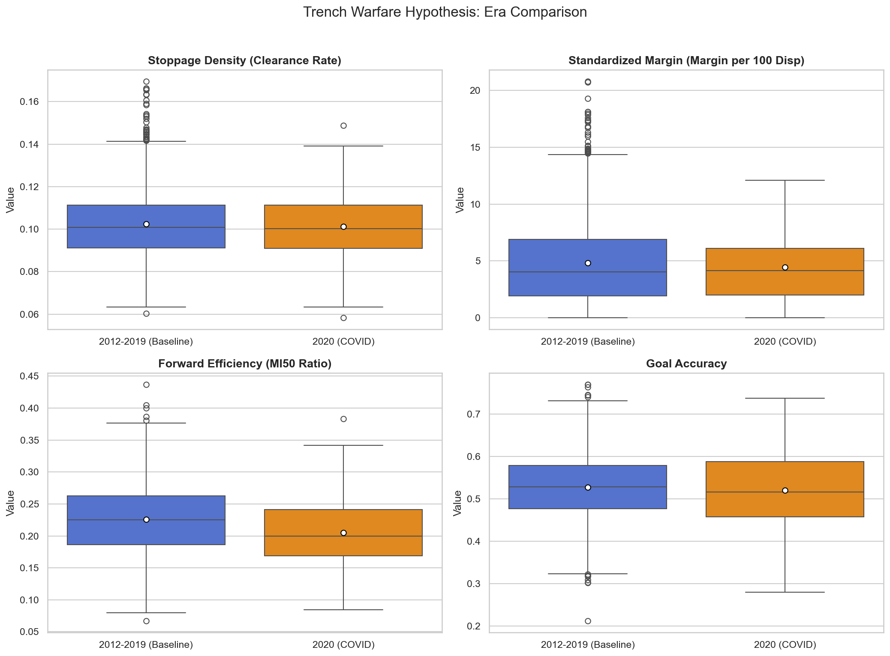
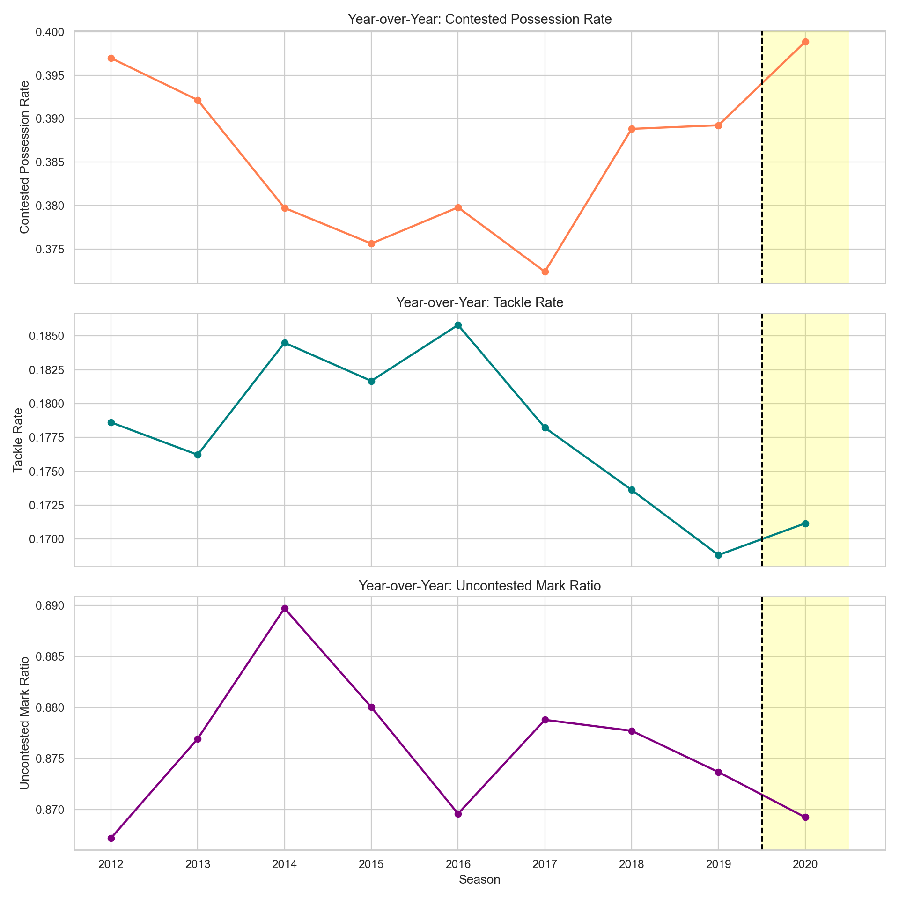

# The Ghost Town Effect: What 2020’s Empty Stadiums Actually Taught Us About AFL Umpire Bias

*A portfolio case study in causal inference, sports analytics, and data-driven storytelling.*

---

## The Footy Pub Myth 

If you sit in the stands at any AFL game long enough, you'll inevitably hear the same complaint: the umpires are being swayed by the crowd. 

In sports science, this is formally known as the **"Noise of Affirmation"**. The theory makes intuitive sense. When 50,000 fans scream "Ball!" every time the opposition is tackled, it creates a massive psychological pressure gradient. It’s entirely plausible that adjudicators, consciously or not, might be nudged into favouring the home team just to ease that pressure. Historically, AFL home teams *have* consistently won the free-kick count, but proving whether that’s due to crowd noise, genuine home-ground confidence, or pure structural noise has always been an empirical nightmare.

Then came the 2020 AFL season. Lockdowns forced the league into isolated hubs, and the stadiums went completely quiet. The roar was gone. For analysts, this was a massive, once-in-a-lifetime natural experiment. If the crowd was driving the bias, removing the crowd should flatten the free-kick differential.

At first glance, that’s exactly what the 2020 data showed. The home advantage in free kicks plummeted. Case closed, right? 

Not exactly. As it turns out, jumping to that conclusion was a massive statistical trap.

> *The Illusion: In the 2012-2019 baseline (Top), home teams enjoyed a distinct free-kick advantage. In the 2020 hub season (Bottom), the distributions converged, heavily implying that the removal of crowds eliminated umpire bias.*

---

## Fixing the Data: The "Away Fan Fallacy"

The problem with just comparing "before 2020" to "during 2020" is that raw attendance data in the AFL is deeply flawed as a measure of partisanship. 

Take the "Away Fan Fallacy". If the Western Bulldogs are hosting Collingwood at Marvel Stadium, the raw attendance numbers might look like a massive home-ground advantage on a spreadsheet. But anyone who actually goes to the footy knows the Pies fans will likely take over the building. Conversely, a 50/50 split at the MCG with the MCC reserve packed out is a completely different psychological environment to a hostile, locked-out Friday night showdown at Adelaide Oval. 

Treating "attendance" as a single, uniform metric produces garbage-in, garbage-out models. 

To fix this, I engineered a **Net Partisan Hostility Index (EPI)**. Instead of just looking at crowd size, this metric recalculated historical pressure by factoring in:
* **Stadium Density:** 35,000 fans packed into GMHBA Stadium is a fortress; 35,000 at the MCG is an echo chamber. We scaled expected crowds against venue capacity.
* **Proportional Fan Splits:** Using 5-year average club membership data, we adjusted for same-state match-ups to accurately map who the fans were actually cheering for. 

This gave us a genuine, continuous variable of how hostile an environment *should* have been on any given day. 

## The Econometrics: Busting the Bias

Armed with a clean variable, I ran a **Fuzzy Difference-in-Differences** regression. The logic here is airtight: if crowds cause umpire bias, the games that historically generated the *most* hostile atmospheres should show the *biggest* shift when those crowds disappeared. 

**They didn't.**

Across five separate Panel OLS model specifications, adjusting for physical game states (contested possessions, territory control), the crowd pressure coefficient was statistically dead. There was no "Noise of Affirmation." In fact, the data showed a marginal tendency for umpires to *overcompensate* in empty stadiums, subtly protecting the home team when the eerie silence set in. 

We also tested for **Institutional Bias**. Do umpires subconsciously favour the big brands? I built a Club Prestige Index (CPI) tracking club memberships, recent premiership success, and Friday night primetime allocations. The result? Another near-zero, non-significant coefficient. The badge on the jumper gives you no statistical armour. 

The myth of the umpiring ride was dead. The officials are actually remarkably resilient. 

> *The Econometric Reality: Cluster-robust 95% confidence intervals across all model specifications demonstrate that while physical game mechanics dictate the whistle, both crowd partisanship (EPI) and institutional brand weight (CPI) fail to reach statistical significance.*

---

## The Plot Twist: Trench Warfare 

If the umpires didn't change their whistle, why did the free kick data converge so sharply in 2020? The answer wasn't psychological. It was physiological. 

The 2020 hub season was a brutal physical grind. Teams were playing off four-day breaks. To manage the load, the AFL shortened quarters from 20 minutes to 16 minutes. Because the game was shorter, you couldn't just compare raw counting stats. I had to convert all the match mechanics into **per-disposal rates** to see how the actual *style* of play had changed.

Once the math was normalised, the real culprit appeared. 

| Metric | Baseline (2012–19) | 2020 (Hub Season) | Change | Significance |
|---|---|---|---|---|
| **Forward Efficiency** (Marks Inside 50 / Total I50) | 22.6% | 20.5% | **−9.2%** | p < 0.0001 |
| **Contested Possession Rate** | 38.4% | 39.9% | **+3.8%** | p < 0.0001 |
| **Total Match Free Kicks** | 37.2 per game | 32.3 per game | **−13.2%** | p < 0.00001 |
| **Tackle Rate** | 17.8% | 17.1% | −4.1% | p = 0.016 |

> *The Trench Warfare Signature: A comparison of structural game mechanics reveals a massive compression in match margins and a catastrophic 9.2% collapse in Forward Efficiency. The 2020 season was structurally gridlocked.*

A 9.2% drop in Forward Efficiency is a structural collapse. It means midfielders didn't have the legs to lower their eyes, and forwards didn't have the anaerobic burst to make clean leads. 

The 2020 season devolved into **Trench Warfare**. The ball spent the entire year trapped in rolling, exhausting, congested scrums. Players were quite literally too tired to run. 

And this solves the free-kick paradox. High-variance free kick counts (holding the man, push in the back, holding the ball) are generated by open, dynamic football where exhausted players are forced into desperate, lunging tackles. When you replace that with a grinding, 36-man scrum where the whistle constantly blows for a neutral ball-up, the free kick variance naturally disappears. 

The free kicks didn't dry up because the fans were gone. They dried up because the run-and-gun mechanics of Australian Rules Football had ground to a halt.

> *Year-over-Year Game Style Evolution: The vertical dashed line marks the 2020 COVID Hub season. The sudden spike in Contested Possession Rate alongside dropping tackle rates highlights the immediate onset of fatigue-driven congestion.*

---

## The Takeaway

What started as an investigation into referee psychology turned into a definitive mapping of athlete physiology. It highlights a core lesson in data science: just because two variables move at the same time (empty stadiums and falling free-kick differentials) doesn't mean they are having a conversation. 

For the armchair critic: the umps aren't being swayed by the cheer squad. They’re just adjudicating the game in front of them. 

## Methodological Footprint

*For technical readers and recruiters, the architecture behind these findings includes:*

* **Causal Inference:** A Fuzzy Difference-in-Differences (DiD) framework was deployed to exploit continuous variation in treatment intensity, providing far more robust causal identification than a binary pre/post split.
* **Feature Engineering & Endogeneity:** Raw attendance was discarded due to endogeneity with team performance. The bespoke Net Partisan Hostility Index (EPI) resolved this by blending static venue density with lagging 5-year membership data to capture true crowd intent without data leakage. 
* **Fixed Effects Modeling:** `linearmodels.PanelOLS` was utilized with Entity (Matchup) and Time (Season) fixed effects to absorb time-invariant stadium quirks and league-wide rule changes, alongside cluster-robust standard errors.
* **Volume-Trap Resistance:** Structural game-style EDA neutralized the mechanical confounding of 2020's 16-minute quarters by strictly converting all counting metrics to per-disposal standardized rates.