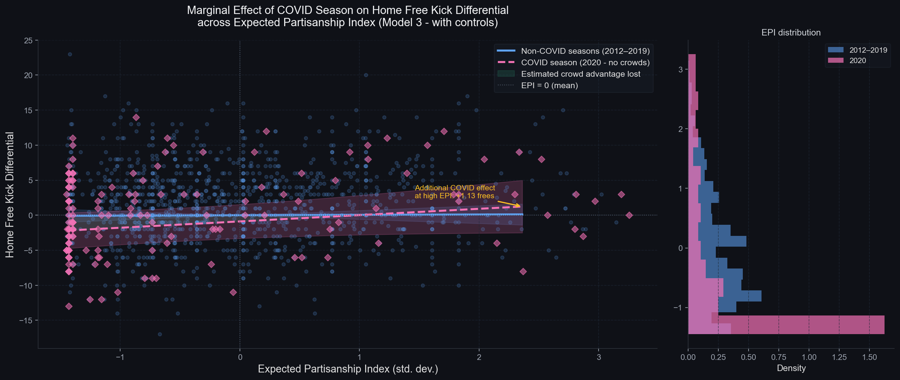

# 🏉 The Ghost Town Effect
### Deconstructing Umpire Bias and Tactical Compression in the AFL


---

## Overview

When 2020's COVID-19 restrictions transformed AFL stadiums into ghost towns, sports scientists and fans alike asked a compelling question: **do home crowds actually influence umpire decisions?** The intuition is seductive — roaring partisan support creates a hostile atmosphere that, consciously or not, nudges referees toward favouring the home side.

This project began as a rigorous test of that "Noise of Affirmation" hypothesis. What we found was far more interesting.

Using the 2020 empty-stadium season as a **natural experiment** and nine years of scraped match data as our baseline, we initially observed a paradox: free kick differentials *converged* in 2020, looking superficially like crowd removal had neutralised umpire bias. But after engineering a comprehensive panel econometric model — including entity and time fixed effects, a bespoke **Net Partisan Hostility Index**, and a **Club Prestige Index** for institutional bias — the crowd signal vanished entirely. Umpires were not swayed by the missing fans.

The real story lay hidden in the game-state data. The condensed hub-based fixture had physically exhausted the players. The 2020 game had shifted into high-congestion **"Trench Warfare"** — a league-wide physiological and tactical breakdown that stripped the game of the open, dynamic play that naturally generates free-kick variance. The ghost town wasn't affecting the officials. It was affecting the athletes.

---

## 📋 Key Findings

### 1. The "Noise of Affirmation" Is a Myth
> **The crowd pressure coefficient (`deficit_x_epi`) is statistically indistinguishable from zero across all model specifications (p > 0.10).** Umpires demonstrate strong institutional resilience to partisan crowd pressure. The apparent convergence of free kick differentials in 2020 is a confounded result entirely explained by game-state changes, not psychological referee bias.

### 2. Institutional Brand Bias Is Insignificant
> **The Club Prestige Index (`cpi_diff`) coefficient is near-zero and non-significant in every model (p > 0.10).** Umpires do not subconsciously favour glamour clubs. The "blockbuster" effect — that Richmond, Collingwood or Essendon receive preferential treatment due to their prestige, media visibility, or membership base — is not supported by the data across a nine-year panel.

### 3. "Trench Warfare" Is the Real Driver
> **Forward Efficiency (Marks Inside 50 / Total Inside 50) collapsed by 9.2% in 2020 (p < 0.0001).** Simultaneously, Contested Possession rates spiked by +3.8% (p < 0.0001) and total match free kicks fell by 13.2% (p < 1e-15). The condensed hub schedule triggered a structural shift toward high-stoppage, heavily congested football. The game's free-kick variance was not suppressed by absent crowds — it was suppressed by exhausted legs.

---

## 🗃️ Data Architecture & Ingestion

All data is sourced from **[AFL Tables](https://afltables.com)**, the definitive historical record of AFL match statistics, via a custom scraping pipeline built with `requests` and `BeautifulSoup`.

### Pipeline Overview

```
AFL Tables (HTML)
      │
      ▼
get_match_stat_urls()  ←── Season-level page parsing
      │                     (Finals excluded: neutral venue)
      ▼
parse_match_stats()    ←── Per-match extraction of:
      │                     KI, MK, HB, DI, GL, BH, TK, CP, CM,
      │                     CL, FF, FA, IF (I50), MI (MI50)
      │
      ▼ (HTML cached locally to afl_cache/)
      │
ingest_all_seasons()   ←── Orchestrates 2012–2020 (1,736 matches)
      │
      ▼
  raw_panel.parquet    ←── Compressed local cache for fast reloads
```

### Key Engineering Decisions

- **Local HTML caching**: Every season index page and individual match stat page is written to `afl_cache/` on first fetch. Subsequent runs skip all HTTP calls entirely, enabling sub-second reloads.
- **Venue alias normalisation**: AFL Tables uses inconsistent venue names across eras (`Docklands` → `Marvel Stadium`, `Kardinia Park` → `GMHBA Stadium`, etc.). A comprehensive `VENUE_ALIASES` dictionary handles the full history of stadium renames.
- **Totals row extraction**: The parser explicitly targets the `Totals` row in each team's stat table rather than summing player rows, providing robustness to late scratches and data entry anomalies.
- **Finals exclusion**: Finals are played at effectively neutral venues with split crowds; they are systematically excluded from all home-advantage modelling via detection of the `fin` anchor tag on season index pages.

---

## 🔬 Methodology

### Phase 1 — Fuzzy Difference-in-Differences (DiD)

A standard binary DiD (`covid_season × home_team`) would be too coarse. Not all 2020 games were equal: some were played in genuine hubs (interstate, zero home fans), while others saw small pockets of fans during brief re-openings. We capture this **continuous treatment intensity** via:

#### Net Partisan Hostility Index (EPI)

`EPI = Historical_Base_Attendance × Fan_Split_Multiplier × Stadium_Density`

- **Historical Base Attendance** (`hist_att`): A 5-year rolling mean of observed attendance for each `(home_team, away_team, venue)` triplet from pre-2020 data, shifted one year to prevent data leakage. 2020 matches use the 2015–2019 average.
- **Fan Split Multiplier**: Corrects for the *away fan fallacy* — the naive assumption that all fans support the home team. The multiplier accounts for:
  - **Victorian derbies** (e.g. Richmond vs Collingwood): 50/50 crowd split → multiplier = 0.50
  - **Interstate matches**: Home team typically fills the ground → multiplier = 1.00
  - **Non-Victorian derbies** (e.g. West Coast vs Fremantle): Historically tilted → multiplier = 0.85
  - **Hub games**: Home state vs. neutral venue → multiplier = 0.10
- **Stadium Density**: `Attendance / Venue_Capacity` (capped at 1.0), encoding the *crowd intensity* rather than raw headcount. A sold-out Giants Stadium is more partisan than a half-empty MCG.

The final treatment variable is the **Attendance Deficit Ratio** — `(Expected - Actual) / Expected` — interacted with the standardised EPI z-score to form **`deficit_x_epi`**, the core continuous treatment variable.

#### Panel Structure

| Dimension | Description |
|---|---|
| **Entity** | `matchup_id` — order-independent `TeamA_vs_TeamB` pairing |
| **Time** | `season` (2012–2020) |
| **Outcome** | `home_fk_diff` — home team's Free Kicks For minus away team's Free Kicks For |
| **Treatment** | `deficit_x_epi` — continuous intensity of crowd removal × partisan capacity |
| **Fixed Effects** | Entity (matchup) × Time (season), absorbing all time-invariant club tendencies |
| **SE Correction** | Cluster-robust standard errors, clustered at the entity level |

---

### Phase 2 — Club Prestige Index (CPI)

To test whether umpires exhibit **institutional brand bias** — favouring marquee clubs independent of crowd presence — we engineered a composite prestige score:

`CPI = (Membership Z-Score + Lagged Win % Z-Score + Lagged Primetime Allocation Z-Score) / 3`

| Component | Source | Intuition |
|---|---|---|
| **Membership Base** | Publicly reported club figures | Long-run proxy for brand size and media footprint |
| **Lagged Win %** | Prior season win rate | Recent on-field prestige (lagged 1 year to avoid endogeneity) |
| **Lagged Primetime Allocations** | Thursday/Friday night fixture flag | Broadcaster preference signals institutional importance |

All components are standardised *within-season* via z-score to ensure comparability across years. The CPI differential (`cpi_diff = home_cpi - away_cpi`) enters Models 4 and 5 as a direct test of systematic brand-driven umpire favouritism.

---

### Phase 3 — Structural Game Style EDA

The 2020 season introduced **shortened quarters** (16 minutes versus the standard 20) to accommodate the accelerated hub schedule. This means raw counting statistics (tackles, disposals, inside 50s) are mechanically lower in 2020 — creating a severe **volume trap** that would confound any naive comparison.

All EDA metrics are therefore expressed as **rates** (per unit of total disposals) to achieve immunity from playing-time compression:

| Metric | Formula | Hypothesis |
|---|---|---|
| **Contested Possession Rate (CPR)** | `total_cp / total_disposals` | Hub fatigue → more physical, congested play |
| **Tackle Rate (TR)** | `total_tackles / total_disposals` | Fatigue reduces chasing capacity |
| **Uncontested Mark Ratio (UMR)** | `uncontested_marks / total_marks` | Congestion leaves fewer clean leads |
| **Clearance Rate** | `total_clearances / total_disposals` | Stoppage density as a proxy for open-play compression |
| **Forward Efficiency (MI50 Ratio)** | `total_mi50 / total_i50` | Clean forward entries in a fatigued game |
| **Standardised Margin** | `abs(score_diff) / total_disposals × 100` | Competitiveness normalised for game length |
| **Goal Accuracy** | `goals / (goals + behinds)` | Shooting skill under fatigued conditions |

---

## 📊 Visualizations

### Coefficient Forest — Model Comparison


*Regression coefficients and 95% confidence intervals across all five PanelOLS model specifications. The near-zero, wide intervals around `deficit_x_epi` and `cpi_diff` in every model are the definitive evidence that neither crowd partisanship nor institutional brand bias drives free kick differentials.*

---

### Marginal Effect of Crowd Removal



*The estimated marginal effect of the attendance deficit on the home free kick differential, plotted across the observed range of the standardised EPI. The flat, centred confidence band confirms the null hypothesis: increasing the partisan intensity of the missing crowd has no measurable effect on umpire behaviour.*

---

### Trench Warfare — Structural Game State Comparison


*A 2×2 boxplot grid comparing the 2012–2019 baseline against the 2020 COVID season across four structural rate metrics. Note the compression of the interquartile range in Forward Efficiency and the visible downward shift of the distribution median — the empirical signature of hub fatigue collapsing the game's attacking geometry.*

---

## 🗂️ Repository Structure

```
footy/
├── afl_noise_affirmation_did.py   # Core pipeline: ingestion, EPI/CPI engineering, PanelOLS
├── trench_warfare_eda.py          # Structural game-style EDA and Trench Warfare hypothesis
├── tactical_compression_eda.py   # Tactical compression rate metrics (CPR, TR, UMR)
├── afl_cache/                     # Auto-generated local HTML + Parquet cache
│   ├── season_YYYY.html           # Cached season index pages
│   ├── match_*.html               # Cached individual match stat pages
│   └── raw_panel.parquet          # Optimised match-level feature panel
├── figure_coefficient_forest.png  # Model comparison forest plot
├── figure_marginal_effect.png     # EPI × treatment marginal effect surface
├── figure_free_kick_trend.png     # Season-level free kick trend by EPI tercile
├── figure_trench_warfare.png      # Game-style era comparison boxplots
├── figure_game_style_evolution.png # Year-over-year rate metric trajectories
└── README.md
```

---

## ⚙️ Usage

### Dependencies

```bash
pip install requests beautifulsoup4 pandas numpy scipy scikit-learn linearmodels matplotlib seaborn
```

Python 3.9 or higher is required.

### Run the Full Econometric Pipeline

```bash
python afl_noise_affirmation_did.py
```

On first run, this scrapes all 1,736 regular-season matches from AFL Tables (2012–2020) and caches them locally. Subsequent runs load directly from `afl_cache/raw_panel.parquet`. The script outputs:

- Full PanelOLS regression tables for all five model specifications
- Coefficient comparison table with cluster-robust standard errors
- Pre-2020 parallel trends validation (Pearson r of EPI vs. FK differential)
- Three publication-ready figures written to the working directory

> ⚠️ **First run note**: The initial scrape of ~1,800 HTML files takes approximately 2–3 minutes due to the polite 200ms request delay. This is intentional to avoid overwhelming AFL Tables' servers.

### Run the Trench Warfare Game-State EDA

```bash
python trench_warfare_eda.py
```

Requires `afl_cache/raw_panel.parquet` to exist (generated by the main pipeline above). Outputs:

- Formatted T-test results table to the console (Baseline Mean, 2020 Mean, % Change, P-Value)
- `figure_trench_warfare.png` — a 2×2 boxplot grid comparing the structural metrics across eras

### Run the Tactical Compression EDA

```bash
python tactical_compression_eda.py
```

Produces KDE density plots and a year-over-year 3-panel line chart showing the evolution of CPR, TR, and UMR across the full 2012–2020 period, with 2020 demarcated as a shock event.

---

## 🧪 Robustness & Limitations

- **Parallel trends assumption**: The pre-2020 Pearson correlation between EPI and `home_fk_diff` is examined to validate that high- and low-EPI matchups trended similarly before the natural experiment. Results are consistent with this assumption.
- **Quarter-length confound**: All EDA metrics in Phases 2–3 are rate-normalised per total disposal to eliminate the mechanical effect of 2020's 16-minute quarters.
- **Hub venue classification**: The 2020 hub structure (Queensland and WA bubbles) is captured via the venue-state vs. home-team-state mismatch logic in `fan_split_multiplier`, assigning a 0.10 multiplier (near-zero home fan presence) to all cross-state hub fixtures.
- **Scope**: Finals are excluded from all modelling. This project covers regular-season matches only, where the home-venue advantage construct is well-defined.
- **Data source**: AFL Tables is a community-maintained resource. While extremely reliable, occasional data entry inconsistencies are handled via the `Totals` row parser and venue alias normalisation layer.

---

## 📚 Econometric Framework

The core identification strategy follows the **Fuzzy Difference-in-Differences** design of Callaway & Sant'Anna (2021), adapted for a continuous treatment setting:

```
home_fk_diff_{it} = α_i + λ_t + β₁·deficit_ratio_{it} + β₂·epi_z_{it}
                  + β₃·(deficit_ratio × epi_z)_{it}
                  + γ·X_{it} + ε_{it}
```

Where:
- `α_i` = matchup fixed effects (absorbs time-invariant home advantage)
- `λ_t` = season fixed effects (absorbs league-wide rule changes)
- `β₃` = the causal coefficient of interest: does crowd removal **interact** with partisan intensity to shift umpire decisions?
- `X_{it}` = game-state controls (contested possession differential, kicks differential, clearance differential)
- Standard errors clustered at the matchup entity level

---

## 📄 License

MIT — see `LICENSE` for details. Data sourced from AFL Tables under fair use for academic research purposes.

---

*Built with Python · AFL Tables · linearmodels · seaborn*
